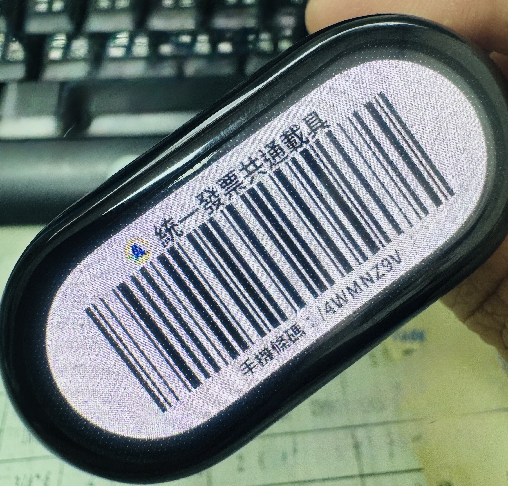
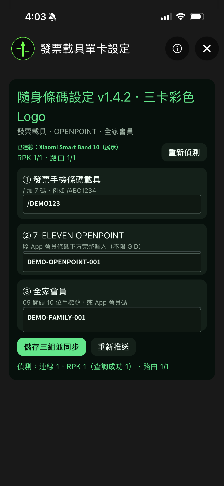

# 隨身條碼｜小米手環 10 三卡條碼

專為 **小米手環 10（Xiaomi Smart Band 10）**製作並完成實機驗證。在 AstroBox NG 中設定個人條碼，由手機產生完整 Code 128 圖片並可靠同步到手環。手環端可左右滑動切換：

1. 財政部電子發票手機條碼載具
2. 7-ELEVEN OPENPOINT／uniopen 會員條碼
3. 全家會員條碼

## 實機成品

<table>
  <tr>
    <td align="center"><strong>小米手環 10 實機顯示</strong></td>
    <td align="center"><strong>AstroBox 三卡設定</strong></td>
  </tr>
  <tr>
    <td></td>
    <td></td>
  </tr>
</table>

> 手環照片為實際顯示效果；手機設定截圖使用虛構展示值，避免公開個人會員資料。

## 適用型號

- **已實機驗證：小米手環 10（Xiaomi Smart Band 10）**
- 系統：小米手環 10 搭載的 Vela OS
- 顯示與操作已依小米手環 10 的長形螢幕、觸控滑動及第三方快捷應用環境調整。
- 其他小米手環或手錶型號尚未實機驗證，不保證可以安裝或正常顯示。

## 最新穩定版本

| 端別 | 檔案 | 版本 |
| --- | --- | --- |
| 手機 AstroBox 外掛 | `einvoice-barcode-three-setter-v1.4.3.abp` | v1.4.3 |
| 小米手環 10 快應用 | `einvoice-barcode-three-band-v1.7.1.rpk` | v1.7.1 |

請從 [GitHub Releases](https://github.com/w902287/astrobox-plugin-einvoice-vehicle/releases/latest) 下載兩個安裝檔。

- RPK package：`tw.einvoice.vehicle.single.band`
- 手環應用名稱：`隨身條碼`
- AstroBox 外掛名稱會顯示為「發票載具單卡設定」；這是為了沿用舊版身分並原位升級，實際內容已是三卡設定。

## 功能

- 三張條碼各自保存，左右滑動循環切換。
- 手機端預先產生 190×480 RGBA PNG，不依賴手環原生 Barcode 或 CSS 旋轉。
- 條碼使用已通過實機掃描的 444×134 幾何與靜區。
- 3 KiB 分片、逐片 ACK、完整大小與 PNG 簽名檢查。
- 三張圖片各自離線快取；手機斷線後仍可顯示。
- 修正條碼後會自動啟動手環 App，並在收到手環回拉前最多送出 5 次同步通知，可靠覆蓋舊快取。
- 進入應用時保持螢幕長亮，離開時自動釋放。
- 彩色發票、OPENPOINT 與 FamilyMart Logo。

## 安裝

### 一、在手機安裝 ABP 外掛

1. 手機安裝並開啟 **AstroBox NG 2.x**。
2. 下載 `einvoice-barcode-three-setter-v1.4.3.abp`。
3. 進入 AstroBox 的「插件／外掛」頁面，點右上角 **＋**。
4. 從檔案管理器選擇 `.abp` 檔。
5. 安裝或更新完成後，完全關閉並重新開啟 AstroBox。
6. 允許外掛要求的權限：
   - `device`
   - `thirdpartyapp`
   - `interconnect`
   - `register_interconnect_recv`

#### Android 出現 `resource.unknown.type...`

這通常不是 ABP 損壞，而是某些 Android 原廠檔案管理器／Document Provider 將檔案交給 AstroBox 時，改成沒有 `.abp` 副檔名的純數字暫存檔名，例如：

```text
resource.unknown.type1000000042
```

請改用其他檔案管理器開啟同一個 `.abp`，或從 AstroBox「插件」頁右上角 **＋**，以能保留原始檔名的檔案管理器選取。無須把 ABP 改成 APK，也無須重新打包。

### 二、在小米手環 10 安裝 RPK

1. 使用 AstroBox 連接 **小米手環 10（Xiaomi Smart Band 10）**。
2. 從裝置頁的「快捷應用」，或安裝隊列右上角 **＋**，選擇 `einvoice-barcode-three-band-v1.7.1.rpk`。
3. 等待安裝完成，手環第三方快捷應用中會出現「隨身條碼」。

如果已經安裝並正常使用 RPK v1.7.1，之後只更新 ABP 時不必重裝 RPK。

## 條碼輸入格式

### ① 財政部手機條碼載具

- 格式為 `/` 加 7 碼，例如：`/DEMO123`
- 忘記輸入 `/` 時，外掛會自動補上。
- 英文字母會統一轉為大寫。

### ② 7-ELEVEN OPENPOINT／uniopen

- **請照 OPENPOINT App「會員條碼」下方顯示的完整字串輸入。**
- 不限制一定要以 `GID` 開頭。
- 英文大小寫會原樣保留，不會自行轉換。
- 接受 4–24 位 Code 128 可編碼的英數字或符號；空白會移除。

例如常見格式可能是：

```text
DEMO-OPENPOINT-001
```

但如果你的 App 顯示非 GID 會員碼，請直接輸入 App 顯示的內容，不要自行添加 `GID`。

### ③ 全家會員

- 可輸入 `09` 開頭的 10 位手機號碼，例如 `09XXXXXXXX`。
- 或照 FamilyMart App 顯示的 8–20 位會員碼輸入。

空白欄位在整批同步時會略過，並保留手環上該卡原有的離線圖片。

## 設定與同步

1. 確認 AstroBox 已真正連接手環。
2. 開啟 AstroBox 中的「發票載具單卡設定」。
3. 點「重新偵測」。正常狀態應類似：

```text
連線 1、RPK 1（查詢成功 1）、路由 1/1
```

4. 輸入需要的條碼，點「儲存三組並同步」。ABP v1.4.3 會嘗試自動啟動手環「隨身條碼」，並送出同步通知。
5. 手環收到通知後會依序回拉三張圖片，以新圖片覆蓋舊快取。
6. 手機會顯示第 1/5～5/5 次通知、手環已請求哪張卡，以及最終寫入完成狀態。
7. 如果五次通知後仍未回拉，保持手環停留在「隨身條碼」畫面，再按「重新推送」。
8. 同步完成後，可在手環左右滑動切換三張條碼。

## 狀態診斷

| 顯示 | 含義與處理方式 |
| --- | --- |
| `連線 0` | AstroBox 尚未真正連上手環；只有配對紀錄不算連線。 |
| `RPK 0` | 手環沒有精確包名，或應用清單快取未刷新；重裝 RPK 後再按「重新偵測」。 |
| `路由 0/1` | 外掛接收權限未授予；重新安裝 ABP 並允許全部四項權限。 |
| 設定已儲存但未同步 | 保持 AstroBox 在前景、開啟手環「隨身條碼」，再按「重新推送」。 |
| `resource.unknown.type<數字>` | Android 檔案管理器遺失 `.abp` 副檔名；改用其他檔案管理器。 |

## 檔案校驗

```text
ABP v1.4.3
e25976c4a6d68d24d52e62e6dd59ae5e10a47ac0d9fe443f75f60f96a4288a84

RPK v1.7.1
ae09066f367f043b368f59426e427e3bc76e77f1edab99a8416970a64be9217d
```

## 已驗證條碼

以下渲染成品均已通過 ZBar Code 128 解碼：

- `/DEMO123`
- `DEMO-OPENPOINT-001`
- `Demo-OpenPoint-02`（非 GID、混合大小寫的虛構測試值）
- `DEMO-FAMILY-001`

## 建置

ABP 使用 Rust、WIT component 與 `wasm32-wasip2`：

```bash
rustup target add wasm32-wasip2
cargo build --target wasm32-wasip2 --release --locked
```

GitHub Actions 會產生 `.abp` 安裝包及四張 Code 128 渲染驗證圖。
